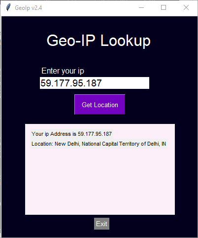

# Geolocation via IP Address using Python

 This project will fetch the geolocation of the entered IP address using <i>simple geo-ip</i> API. 

# Application 

# Built with

 Python for writing main logic & Tkinter module for frontend web application

